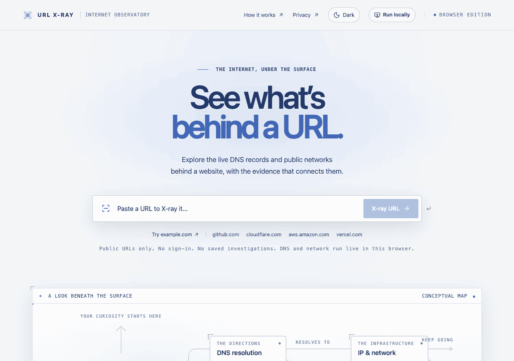

# URL X-Ray

An evidence-first, interactive map of the public Internet infrastructure behind a URL.

Paste a URL, and the instrument runs a live investigation: it resolves the hostname, follows the
redirect chain, reads the response headers, inspects the TLS certificate, and looks up the network
that owns the answering IP addresses. Every claim it renders is labelled **observed**, **inferred**,
or **unknown**, and links back to the piece of evidence it came from. Nothing is presented as fact
because it looks plausible.

> **Private, unreleased project.** This repository is not published, not licensed for use outside the
> project, and not hardened for multi-tenant or production hosting. See [LICENSE](LICENSE) and
> [SECURITY.md](SECURITY.md).



## Requirements

- Node.js 22 or newer (`engines.node: ">=22"`)
- npm (the repository ships a `package-lock.json`; use `npm ci`)

No API keys, accounts, or `.env` file are required to run the instrument. Fonts are vendored as local
npm packages (`@fontsource-variable/instrument-sans`, `@fontsource/ibm-plex-mono`), so no font CDN is
contacted at build or run time.

## Getting started

```bash
npm ci
npm run dev
```

Then open <http://127.0.0.1:3099>.

The dev server binds `127.0.0.1` deliberately: the instrument makes outbound requests on behalf of
whoever can reach it, so it should not be listening on a shared interface.

## Scripts

| Script | What it does |
| --- | --- |
| `npm run dev` | Next.js dev server on `127.0.0.1:3099` |
| `npm run build` | Production build |
| `npm start` | Serve the production build on `127.0.0.1:3099` |
| `npm run typecheck` | `tsc --noEmit` |
| `npm test` | Vitest unit tests (`tests/unit/**/*.test.ts`) |
| `npm run test:e2e` | Playwright end-to-end tests (`tests/e2e`) |
| `npm run check` | typecheck, then unit tests, then build |

## How a run works

The client posts a URL to the investigation API and reads the response as a stream of
newline-delimited JSON (NDJSON) events, so each layer appears as soon as it resolves instead of the
page waiting for the slowest lookup.

```
POST /api/investigate    { "url": "https://example.com/path" }
-->  application/x-ndjson, one JSON event per line:
     {"type":"start","investigation":{...}}
     {"type":"update","investigation":{...}}     (repeated, once per layer)
     {"type":"complete","investigation":{...}}
     {"type":"error","message":"a message safe to show a person"}
```

`start`, `update`, `complete`, and `error` are the four event types; `complete` and `error` are
terminal. The decoder in `src/lib/client/stream.ts` is independent of network chunk boundaries, and
`src/lib/client/use-investigation.ts` owns cancellation and per-run generation tracking so a stale
stream can never overwrite a newer one.

**Status:** the live V1 and V1.5 path is implemented. The API streams snapshots from independent DNS, HTTP, TLS, network, and technology providers into the evidence model and the interactive graph.

## What it looks at

The investigation is organised as layers, each backed by its own provider (see
`ProviderId` in `src/lib/types.ts`):

- **The URL** itself, parsed and normalised
- **DNS resolution** over DNS-over-HTTPS
- **The response**: redirect chain, final status, and security-relevant response headers
- **TLS certificate**: issuer, subject, subject alternative names, validity, chain
- **IP and network**: ASN, reported network organisation, prefix, registry country
- **Technologies** and **edge/hosting**, inferred from the evidence above and labelled as inferred

## Roadmap

**V1: core investigation, implemented.** URL parsing, DNS resolution, redirect chain and response headers, IP and network affiliation, the evidence model, and the infrastructure graph.

**V1.5: TLS and technology, implemented.** Certificate inspection and the technology and edge/hosting inference layer, each entry carrying the evidence ids it was derived from.

**V2: compare and history.** Investigate two URLs side by side, and a session-scoped history of the
runs made in the current browser session.

**V3 (optional, not committed): third-party enrichment.** Optional, explicitly opt-in enrichment from
an external scanning service such as urlscan.io.

Nothing in V2 or V3 is implemented today. Nothing in the codebase talks to urlscan.io or any other
third-party scanning service, and there is no historical persistence: re-running a hostname performs a
fresh live investigation rather than reading back a stored snapshot.

## Documentation

- [docs/ARCHITECTURE.md](docs/ARCHITECTURE.md): module layout, the event stream, and the evidence model
- [SECURITY.md](SECURITY.md): the request safety model and what an investigation exposes
- [CONTRIBUTING.md](CONTRIBUTING.md): local workflow and the bar for a change
